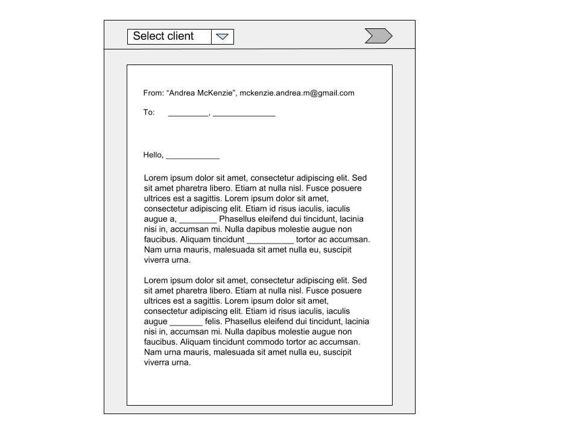

# Invoicer
## Created by Andrea McKenzie
 - Email: [mckenzie.andrea.m@gmail.com](mailto:mckenzie.andrea.m@gmail.com)
 - LinkedIn: [Andrea McKenzie](https://www.linkedin.com/in/andrea-mckenzie/)
 - Skype: andrea.michelle.mckenzie

 Invoicer is a React/Express application that sends template emails to your saved clients. 
 - **MVP** Sends a single email to a single client at a time
 - **MVP + 1** Uploads attachments and sends single email with an attachment to single client
 - **MVP + 2** Sends multiple emails to multiple clients
 - **MVP + 3** Sends multiple enails to multiple clients with respective attachments
 - **MVP + 4** Emails support styling and User can CRUD templates
 - **FULL VP** Supports OAuth with Google/phone and imports contacts

## Packages used:
 - [Nodemailer](https://nodemailer.com/) - Sends emails with built-in STMP support
 - [Passport](http://www.passportjs.org/),[Passport-Local](https://github.com/jaredhanson/passport-local), and [Express-Session](https://www.npmjs.com/package/express-session) - Authentication for users with [BcryptJS](https://www.npmjs.com/package/bcryptjs) hash salting for security

## Wireframe

## Database schema

### Users
| Column | email | password-digest | name | company | icon | id | Signiture |
|---|---|---|---|---|---|---|---|
| type | VARCHAR | TEXT | VARCHAR | VARCHAR | VARCHAR | SERIAL | VARCHAR |
| Primary key | false | false | false | false | false | true | false |
| References | N/A | N/A | N/A | N/A | N/A | N/A | N/A |
| Not Null | true | true | false | false | false | true | false |
| Default | N/A | N/A | N/A | N/A | N/A | N/A | N/A |

### Contacts
| Column | name | email | company | owed | service | id | contractor-id |
|---|---|---|---|---|---|---|---|
| type | VARCHAR | VARCHAR | VARCHAR | FLOAT | VARCHAR | SERIAL | INTEGER
| Primary key | false | false | false | false | false | true | false |
| References | N/A | N/A | N/A | N/A | N/A | N/A | user(id) |
| Not Null | true | true | false | true | false | true |
| Default | N/A | N/A | N/A | 0 | N/A | N/A | user(id) |

<!-- invoice attachment file link? -->
**Note** - I may end up adding an invoice column depending on whether or not I can get the attachments to work. 

### Templates

| Column | template | id | 
|---|---|---|
| Type | TEXT | SERIAL |
| Primary Key | false | true | 
| References | N/A | N/A |
| Not Null | true | true | 
| Default | N/A | N/A |

### Optional: Saved Emails
**Note** - this depends on `nodemailer`'s options for sent emails. 

<!-- table somewhere of invoices to crud as well
 -->

